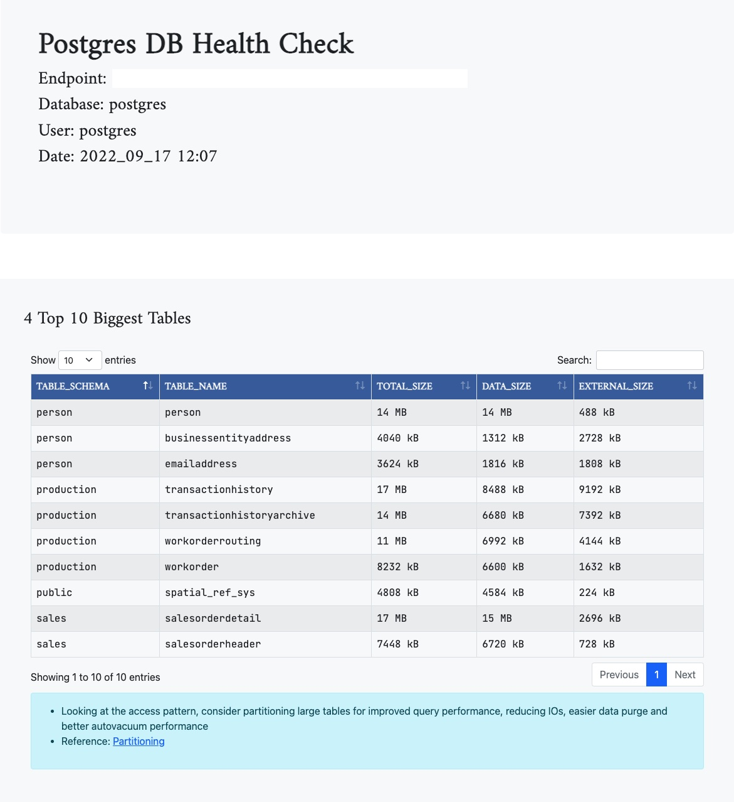

# Postgres DB Health checks
A Python tool to execute Postgres DB queries to show database state/health in a HTML form. 

## How to execute?

- Update `~/.pgpass` file to include DB Host and password.
- run 
    ```sh
    python app.py
    ```

## HTML Report
- HTML report will be placed in the `reports` folder.
****

## Pre-requisites
- Python 3.8
- Few Python packages (see `requirements.txt`)

****
## Sample



